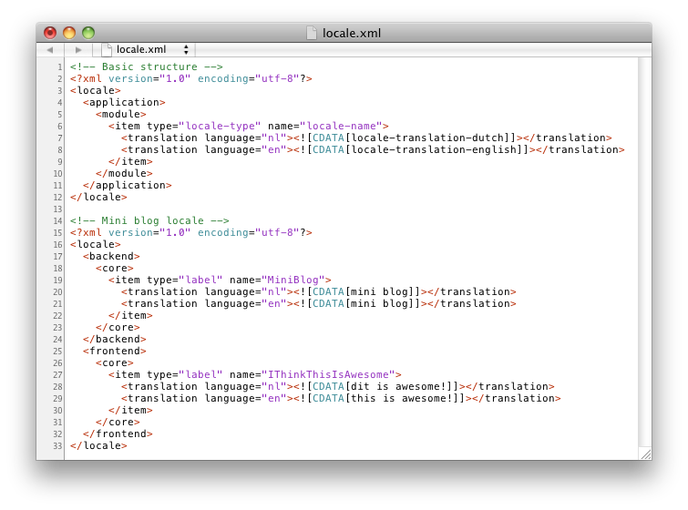
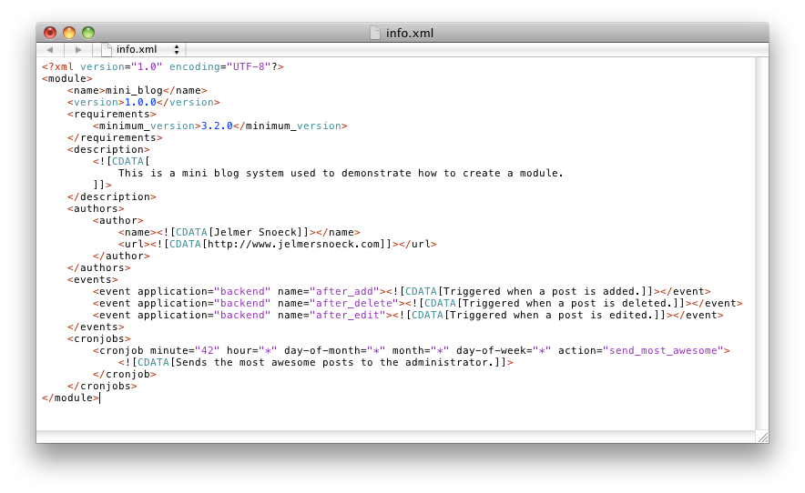

# Creating an installer

To create an installer, you need some basic files. First of all, you need the installer file. This is located in the backend installer folder. For our module this would be /backend/modules/mini_blog/installer/installer.php.

Next to this file, depending on the module, you can have some other files, mostly used are the install.sql file and the locale.xml file. We'll put these in the subdirectory /data. 

## Installer

In the installer file we load the database tables (if required) and the locale (if required). Besides this, we also make sure our users have rights to access our module.

```
class MiniBlogInstaller extends ModuleInstaller
{
	/**
	 * Install the module
	 */
	public function install()
	{
		$this->importSQL(dirname(__FILE__) . '/data/install.sql');

		$this->addModule('mini_blog');

		$this->importLocale(dirname(__FILE__) . '/data/locale.xml');
```

Now we want to make sure that our module can be accessed for the search module and for other users that aren't god users. We do this by adding some rules:

```
$this->makeSearchable('mini_blog');
$this->setModuleRights(1, 'mini_blog');

$this->setActionRights(1, 'mini_blog', 'index');
$this->setActionRights(1, 'mini_blog', 'add');
$this->setActionRights(1, 'mini_blog', 'edit');
$this->setActionRights(1, 'mini_blog', 'delete');
```

After we've added our rights, we want to create an option so we can add our blog to the frontend. To do this, we need to create some extras. Since we also have a widget with the recent posts, we also need to create an extra for that. We do this by adding the following code:

```
$miniBlogId = $this->insertExtra('mini_blog', 'block', 'MiniBlog');
$this->insertExtra('mini_blog', 'widget', 'RecentPosts', 'recent_posts');
```

The first extra will allow us to show the overview and other actions. The second extra will allow us to add the widget on pages. For this method, the first three parameters are mandatory. Here is a list of parameters:

* module: the module we want to install the extra for
* type: the type of extra we want, this can be a block or a widget
* label: this is the label we should use in the dropdown navigation if we select our extra
* action: the action we should call if this extra is called, if none is given, the base action is index

Last but not least, we want to be able to manage our blog. To do this, we need to add some navigation rules for the backend. 

```
// set navigation
$navigationModulesId = $this->setNavigation(null, 'Modules');
$navigationBlogId = $this->setNavigation($navigationModulesId, 'MiniBlog', 'mini_blog/index', array('mini_blog/add',	'mini_blog/edit'));
```

At first, we fetch the id for the Modules navigation that you can see at the top of your backend. We do this because we want our module to come in that navigation tree.
After that, we add a new navigation item. The parameters for this are explained below:

* parentId: the id of the parent (in this case, the modules navigation tree, but this could also be our module itself if we have subnavigation, e.g. categories, comments, ...)
* label: the label we should use for this navigation item
* url: the action we should call if we select this item
* selectedFor: in this case, we want our add and edit action to have the same navigation item as our index action, to do this, we add an array that contains these navigation actions.

## Locale

Fork already has a wide range of labels, messages, errors and actions pre installed. Though, it is possible you'll need some extras. To do this, we provide a locale.xml file that we use in our installer. To parse the data, we use a specific structure. In the screenshot below, you'll see that basic structure, followed by the xml for the mini blog module.



As you can see, we specify 2 children in the main node. These are backend and frontend (you can use one aswell). Within the application, for each module you have locale parameters, you create a new node with that module name. All the items within this node will be installed for the given module.

## Database

To add the requried database files, we need to create a file called install.sql in the /backend/modules/mini_blog/install/data folder. For the rest, this is pretty basic. It's just a dump of your table.

```
CREATE TABLE `mini_blog` (
  `id` int(11) NOT NULL AUTO_INCREMENT,
  `title` varchar(255) CHARACTER SET utf8 DEFAULT NULL,
  `introduction` text CHARACTER SET utf8,
  `text` text CHARACTER SET utf8,
  `created` datetime DEFAULT NULL,
  `edited` datetime DEFAULT NULL,
  `publish` enum('Y','N') CHARACTER SET utf8 DEFAULT 'Y',
  `user_id` int(11) DEFAULT NULL,
  `language` varchar(3) CHARACTER SET utf8 DEFAULT NULL,
  `meta_id` int(11) DEFAULT NULL,
  `awesomeness` int(11) DEFAULT '0',
  PRIMARY KEY (`id`)
) ENGINE=MyISAM AUTO_INCREMENT=8 DEFAULT CHARSET=utf8 COLLATE=utf8_unicode_ci;
```

## Info

We also provide a info.xml with each module. This allows us to see some information about it. The main node is the <module> node. Below is a screenshot of the info.xml file for the mini blog.



As you can see, we have several sections in the module node. The upper part(name - authors) is to give some information about the module itself. The lower part(events-cronjobs) is information that we can use for other modules. The events system is already explained in another article.